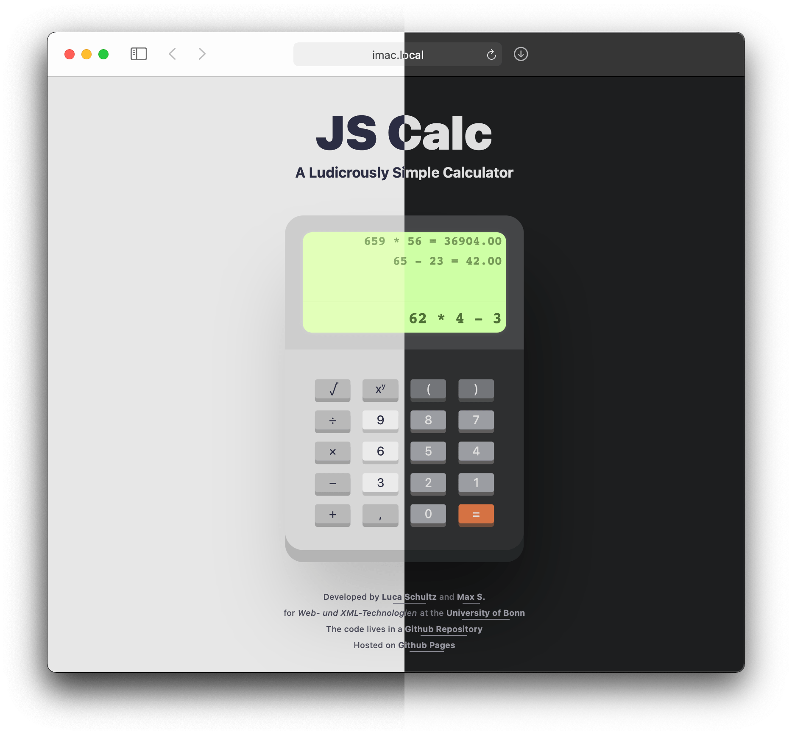

# JS Calc - A Ludicrously Simple Calculator

This calculator is based on HTML, CSS and Javascript and was created for a beginner project of the lecture *Web- und XML-Technologien* at the [Instute of Computer Science](https://www.informatik.uni-bonn.de/de) of the [Rheinische Friedrich-Wilhelms-Universität Bonn](https://www.uni-bonn.de). The resulting static page is available [here](https://lucaschultz.github.io/jscalc/).

### Code Quality

Both of the authors are (at the time of this writing) absolute web devolepment novices and this was one of their very first projects. If you have any improvement ideas or questions, please open an issue or a pull request. 

If you wan't to use the code, go ahead! But be warned, we didn't know what where doing, so you better do!

### Functionality

It's a calculator! A few not so obvious details are:

- Automatic darkmode, triggered by the `@media (prefers-color-scheme: dark)` media query
- Enter calculations using the keyboard
- The ability to scroll overflowing lines horizontally
- Clicking on a line in the history loads it as input

### TODO

- [x] Add actual calculator functionality
- [x] Add ability to click on a history item to reuse the calculation
- [ ] Add an *AC* key
